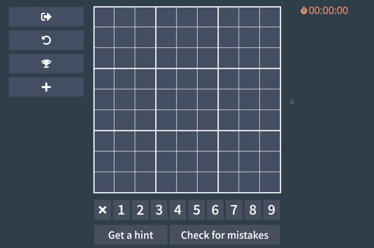
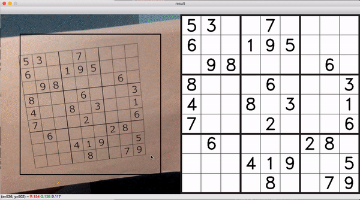

# sudoku-app

The main goal was to build an app that is capable of helping with sudoku solving. Project expanded, and more functions appeared:
 - [x] Generate random sudoku board
 - [x] Import from file
 - [x] Import from image and webcam (also capable of recognizing handwritten sudoku)
 - [x] Timer and scoreboard

## Technologies:
 - Python with Tkinter (GUI toolkit), OpenCV (real-time computer vision) 
 - TensorFlow and Keras -> Convolutional Neural Network with "The Chars74K" image dataset for character recognition.

## Scanning via webcam:

## And the process behind it:

## Team :punch:
### - [`Wojtek Achtelik`](https://github.com/WojtAcht)
### - [`Błażej Kustra`](https://github.com/Forlify)
